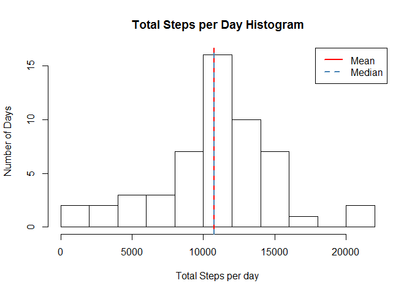
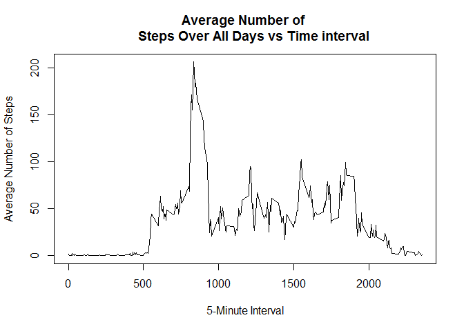
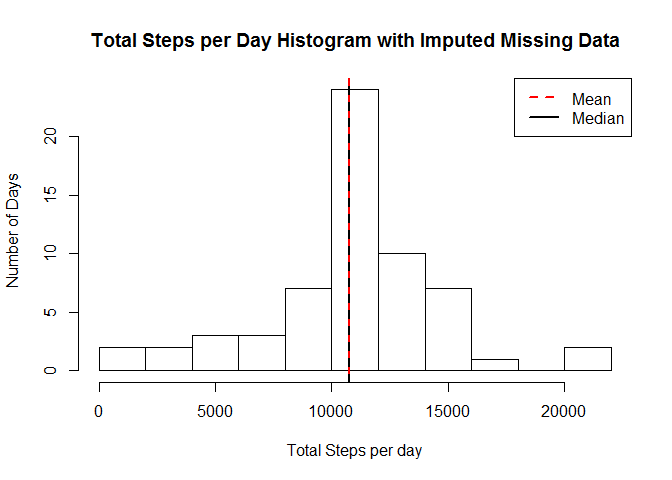
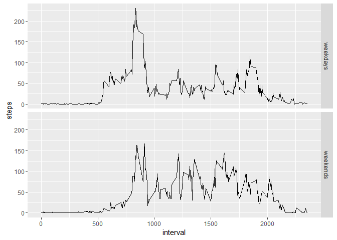

Introduction
------------

A description of the project/assignment requirements is presented on
repo file **README.md** (Forked Content from [Roger D. Peng @
GitHub](https://github.com/rdpeng)).

Methods/Results
---------------

### Loading and Preprocessing the Data

    # Load data file - activity.csv
    activity <- read.csv("activity.csv", sep = ",")
    # head(activity)
    summary(activity)

### The Mean Total Number of Steps per Day

The number of steps were grouped by date and intervals using
**reshape2** package. Days with no steps were removed.

    library(reshape2)

    ## Warning: package 'reshape2' was built under R version 3.1.3

    activity_melt <- melt(activity[which(!is.na(activity$steps)), ], id.vars = c("date", "interval"))
    head(activity_melt)
    steps_sum <- dcast(activity_melt, date ~ variable, sum)
    head(steps_sum)

Then the summary can present the mean and median data.

    summary(steps_sum$steps)
    mean_steps <- mean(steps_sum$steps)
    median_steps <- median(steps_sum$steps)

Then the histogram of the total number of steps taken each day can
displayed.

    hist(steps_sum$steps, main = "Total Steps per Day Histogram",
      xlab = "Total Steps per day", ylab = "Number of Days", breaks = 10)
    abline(v = mean(steps_sum$steps), lty = 1, lwd = 2, col = "red")
    abline(v = median(steps_sum$steps), lty = 2, lwd = 2, col = "steel blue")
    legend(x = "topright", c("Mean", "Median"), col = c("red", "steel blue"),lty = c(1, 2), lwd = c(2, 2))

The mean and median are respectively 1.076618910^{4} and 10765, about
the same.

### The Average Daily Activity Pattern

A time series plot (i.e. type = "l") of the 5-minute interval (x-axis)
and the average number of steps taken averaged across all days was
constructed.

    stepsmeaninterval <- dcast(activity_melt, interval ~ variable, mean, na.rm = TRUE)
    plot(stepsmeaninterval$interval, stepsmeaninterval$steps, ty = "l", 
         xlab = "5-Minute Interval", ylab = "Average Number of Steps", main = "Average Number of 
         Steps Over All Days vs Time interval")

The maximum average can be calculated.

    maxsteps_interval <- stepsmeaninterval$interval[which.max(stepsmeaninterval$steps)]
    maxsteps_interval

As seen in the plot, 835th interval, on average across all the days,
contains maximum number of steps.

### Imputing Missing Values

    na_data_total <- sum(is.na(activity$steps))
    # Percentage of rows with missing values
    effect <- sum(is.na(activity$steps))*100/nrow(activity) 

There are 2304 missing values in the dataset (i.e. the total number of
rows with NAs). In order to impute missing values, finding intervals
with the missing values should be identified. In other words, find out
whether there are days with all time intervals reporting NA step values.
The missing data for a day can be replaced by the time average over all
other days. A new dataset is created.

    new_activity <- split(activity, activity$interval)
    new_activity <- lapply(new_activity, function(x) {
      x$steps[which(is.na(x$steps))] <- mean(x$steps, na.rm = TRUE)
      return(x)
    })
    new_activity <- do.call("rbind", new_activity)
    row.names(new_activity) <- NULL
    new_activity <- split(new_activity, new_activity$date)
    df <- lapply(new_activity, function(x) {
      x$steps[which(is.na(x$steps))] <- mean(x$steps, na.rm = TRUE)
      return(x)
    })
    new_activity <- do.call("rbind", new_activity)
    row.names(new_activity) <- NULL
    #head(new_activity)

The time intervals form a disjoint partitioning of 24 hrs, i.e. 1 day is
found to be erroneous meaning the time interval for each day corresponds
to about 40 hours. This refutes the intervals being disjoint.

    library(reshape2)
    activity_melt2 <- melt(new_activity, id.vars = c("date", "interval"))
    new_steps_sum <- dcast(activity_melt2, date ~ variable, sum, na.rm = TRUE)
    #head(new_steps_sum)
    #summary(new_steps_sum$steps)
    new_mean_steps <- mean(new_steps_sum$steps)
    new_median_steps <- median(new_steps_sum$steps)
    hist(new_steps_sum$steps, main = "Total Steps per Day Histogram with Imputed Missing Data", 
      xlab = "Total Steps per day", ylab = "Number of Days",breaks = 10)
    abline(v = mean(steps_sum$steps), lty = 1, lwd = 2, col = "red")
    abline(v = median(steps_sum$steps), lty = 2, lwd = 2, col = "black")
    legend(x = "topright", c("Mean", "Median"), col = c("red", "black"), lty = c(2, 1), lwd = c(2, 2))

The new mean and median are respectively 1.076618910^{4} and
1.076618910^{4}. As expected the mean is almost the same as the first
part; however, the old median slightly changes to the new mean. This is
due to the fact as the missing data constitue 13.1147541% of the total
number (row) data.

### Differences in Patterns between Weekdays and Weekends

A new column is created describing if the date is a weekday or weekend.

    library(lubridate)

    ## Warning: package 'lubridate' was built under R version 3.1.3

    ## 
    ## Attaching package: 'lubridate'

    ## The following object is masked from 'package:base':
    ## 
    ##     date

    weekends <- which(weekdays(as.Date(new_activity$date)) == "Saturday"
    |weekdays(as.Date(new_activity$date))=="Sunday")
    weekdays <- which(weekdays(as.Date(new_activity$date)) != "Saturday" 
    & weekdays(as.Date(new_activity$date)) != "Sunday")
    temp <- c(rep("a", length(new_activity)))
    temp[weekends] <- "weekend"
    temp[weekdays] <- "weekday"
    length(temp)
    names(temp) <- "day"
    new_activity <- cbind(new_activity, temp)
    names(new_activity)[4] <- "day"

Steps taken over each interval was averaged across weekdays and
weekends.

    new_activity_split <- split(new_activity, new_activity$day)
    stepsmean_interval <- lapply(new_activity_split, function(x) {
      temp <- aggregate(x$steps, list(x$interval), mean)
      names(temp) <- c("interval", "steps")
      return(temp)
    })

    ## stepsmean_interval
    stepsmean_interval <- do.call("rbind", stepsmean_interval)
    weekdays <- grep("weekday" ,row.names(stepsmean_interval))
    weekends <- grep("weekend" ,row.names(stepsmean_interval))
    temp <- c(rep("a", length(stepsmean_interval$steps)))
    temp[weekdays] <- "weekdays"
    temp[weekends] <- "weekends"
    stepsmean_interval <- cbind(stepsmean_interval, temp)
    row.names(stepsmean_interval) <- NULL
    names(stepsmean_interval)[3] <- "day"
    head(stepsmean_interval)
    tail(stepsmean_interval)

    library(ggplot2)

    ## Warning: package 'ggplot2' was built under R version 3.1.3

    ggplot(stepsmean_interval, aes(interval, steps)) + geom_line() + facet_grid(day ~ .) 

The mean number of steps taken over the weekdays and weekends is
calculated using the following:

    stepsdatamelt <- melt(stepsmean_interval, id.vars = c("interval","day"))
    dcast(stepsdatamelt, day ~ variable, mean) # Average steps

    ##        day    steps
    ## 1 weekdays 35.61058
    ## 2 weekends 42.36640

Conclusion
----------

As a whole, the project assignement was an excellent introduction to
using **knitr** and **R markdwon**. In terms of data analysis, the
answer to the questions still need to be justified to validate the
reproducibility process.
